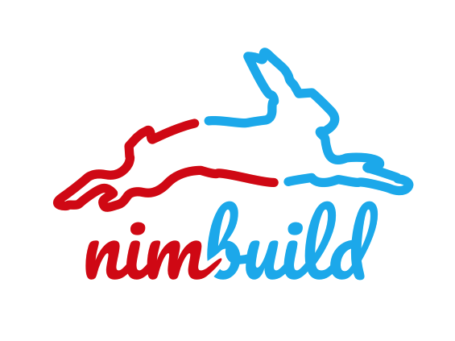

# @vrbo/nimbuild

A suite of build tools that enable ultra fast web bundling at run-time.

## Packages

-   [@vrbo/nimbuild-webpack](./packages/nimbuild-webpack)
-   [@vrbo/nimbuild-corejs](./packages/nimbuild-corejs)
